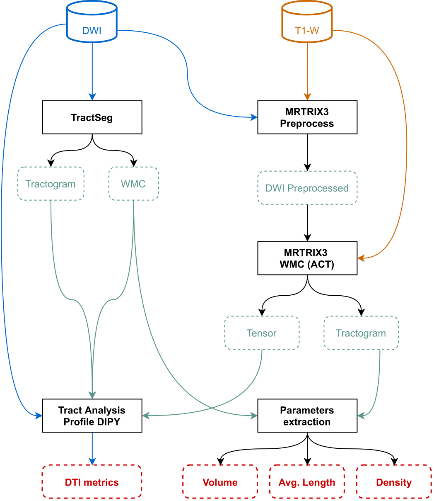

# Morphologic parameters extraction
This module implements functionalities to deal with the extraction of fiber bundles' statistics such as average length, density and volume, for each subject in the dataset through the [Brainlife](http://brainlife.io) APIs.
The file *computeTracstStatistics.m* is an adaptation of [tractographyQualityCheck](https://github.com/brainlife/app-tractographyQualityCheck), an application that computes various statistics from an input tractogram and any associated white matter classification (WMC) structure. 
The code was customized to accomodate our needs for this particular project.

Due to limitations in computing resources and disk space, we couldn't store tractograms and WMC structures for all subjects, thus we implemented a processing pipeline which downloads the required files via Brainlife APIs, extracts tract statistics and finally removes the files before processing the next subject.

For each of the 99 subjects in our study, the function *computeTractsStatistics* will generate a .csv file reporting statistics for each of the 72 fiber bundles that the white matter was subdivided in by [tractseg](https://github.com/brainlife/app-tractseg).

## Preprocessing pipeline
&nbsp;


This module deals with the final part of the preprocessing pipeline, indicated as *Parameters extraction* in the above schematic.


&nbsp;
## Module structure:
The module is organized as follows:
```
MATLAB/
│    README.md: you are here
└─── input/
│       classification.mat
│       track.tck
│       tracts/
└─── output/
│    └─── statistics/
│           001.csv
│           002.csv
│             ...
└─── tractStats
        computeTractsStatistics.m
        config.json
        main.sh
```

In greater detail:

- *classification.mat*: white matter classification file
- *track.tck*: tractseg's tractogram
- *computeTractsStatistics.m*: script that takes WMC structure and a tractogram and computes tract statistics for each of the 72 fiber bundles.
- *config.json*: json file containing paths to tractogram, WMC structure and tracts.
- *main.sh*: script to execute the process of extracting tract statistics for each bundle and subject, one at a time.


## Requirements
* **Brainlife CLI**: interaction with Brainlife's APIs; remember that the DWI scans are stored on Brainlife. Installation instructions [here](https://brainlife.io/docs/cli/install/).
* **jq**: tool for reading, filtering and writing JSON files in bash. Download it [here](https://stedolan.github.io/jq/).
* **MATLAB**: other than MATLAB, you will need the following modules. Each one must be added to the MATLAB's search path.
    * [encode](https://github.com/brain-life/encode): framework to encode structural brain connectomes into multidimensional arrays (tensors).
    * [jsonlab](https://it.mathworks.com/matlabcentral/fileexchange/33381-jsonlab-a-toolbox-to-encode-decode-json-files): a toolbox to encode/decode JSON files.
    * [vistasoft](https://github.com/vistalab/vistasoft): a toolbox to perform a variety of analysis on MRI data, including diffusion MRI.
    * [wma_tools](https://github.com/DanNBullock/wma_tools): a toolbox to perform anatomically informed white matter segmentations and analyze the outputs.